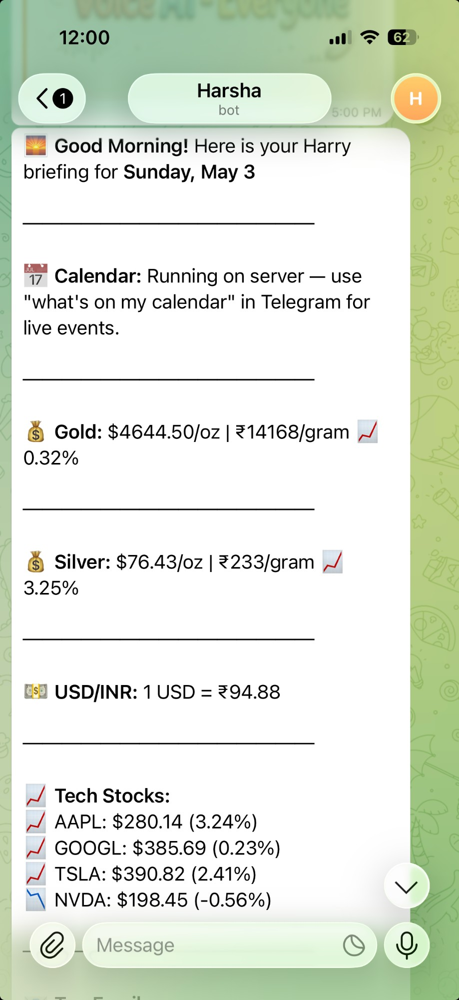
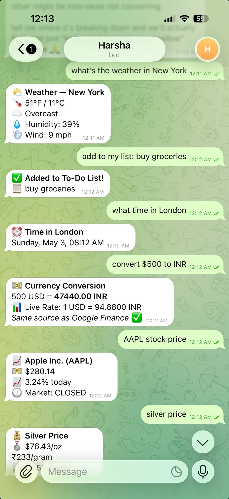
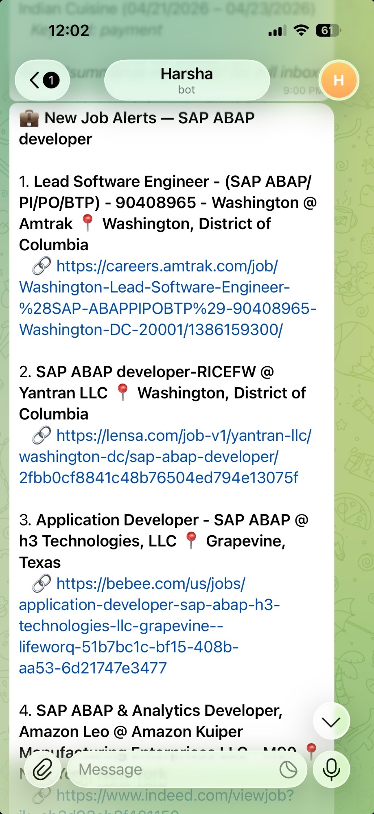
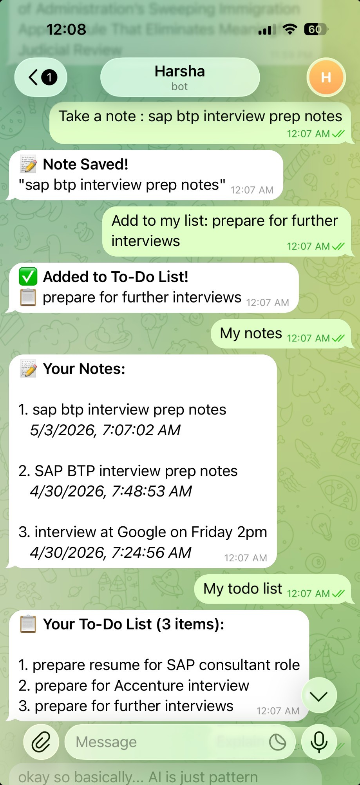

# AI Personal Automation System

> A fully autonomous AI-powered assistant running 24/7 on Oracle Cloud — built with n8n, Claude API, and 10+ live integrations.

---

## Overview

This is a production automation system I designed and deployed from scratch — no team, no prior coding background, built entirely through AI-assisted development and hands-on learning.

It processes natural language requests via Telegram and runs 15+ scheduled workflows autonomously. Zero manual intervention required.

**Stack:** n8n · Claude API (Anthropic) · Oracle Cloud VPS · Telegram Bot API · REST APIs

---

## Architecture

```
┌─────────────────────────────────────────────────────────────┐
│                    INPUT LAYER                              │
│   Telegram Bot ─────────── On-demand queries               │
│   Schedule Triggers ─────── Hourly / Daily jobs            │
│   Gmail Trigger ─────────── Real-time email monitoring     │
└────────────────────────┬────────────────────────────────────┘
                         │
                         ▼
┌─────────────────────────────────────────────────────────────┐
│           ORCHESTRATION LAYER — n8n on Oracle Cloud         │
│                        (24/7)                               │
│  • Route by intent       • Parallel API calls              │
│  • Merge + deduplicate   • Cross-run memory (static data)  │
│  • Error handling        • Conditional branching           │
└────────────────────────┬────────────────────────────────────┘
                         │
       ┌─────────────────┼─────────────────┐
       ▼                 ▼                 ▼
 Claude API          Live APIs         Google APIs
 • Email classify    • JSearch         • Gmail
 • Responses         • Finance         • Calendar
 • Summarization     • Weather
                     • News
                     • USCIS
                         │
                         ▼
              Telegram — formatted alerts,
              answers & daily briefings
```

→ Full architecture details: [docs/ARCHITECTURE.md](docs/ARCHITECTURE.md)

---

## 📸 Live Screenshots

<table>
  <tr>
    <td align="center"><b> Morning Briefing</b><br/><sub>Daily automated summary — gold, stocks, USD/INR, calendar</sub><br/></td>
    <td align="center"><b> On-Demand Assistant</b><br/><sub>Weather, time zones, currency conversion, stocks — instantly</sub><br/></td>
  </tr>
  <tr>
    <td align="center"><b> SAP Job Alerts</b><br/><sub>Hourly scan — new jobs delivered with direct links</sub><br/></td>
    <td align="center"><b> Notes & To-Do</b><br/><sub>Persistent memory — save notes and tasks via chat</sub><br/></td>
  </tr>
</table>

---

## Workflows (15+ total)

###  1. SAP Job Alert — 24/7 (`workflows/sap_job_alert.json`)
Runs every hour. Searches 3 role categories across JSearch API (aggregates LinkedIn, Indeed, Glassdoor, ZipRecruiter). Filters for H1B-friendly companies and sponsorship keywords. Deduplicates across runs. Sends formatted Telegram alerts for new matches only.

**Key features:**
- 3 parallel searches merged into one pipeline
- H1B sponsor company list (Infosys, TCS, Wipro, Cognizant, Deloitte, Accenture, IBM, etc.)
- Keyword filtering: `h1b`, `visa sponsor`, `will sponsor`, `opt accepted`
- Cross-run deduplication (persists 3,000 seen job IDs)
- Graceful error handling — continues if one search fails

---

###  2. Intelligent Email Triage (`workflows/email_triage.json`)
Monitors Gmail every 5 minutes. Classifies emails using Claude API.
- **Urgent** (USCIS, job offers, banking) → instant Telegram alert
- **Promotional / newsletters** → silently filtered
- Result: ~80% reduction in inbox noise

---

###  3. Daily Finance Briefing (`workflows/finance_briefing.json`)
Runs every morning at 8 AM. Fetches live gold price, USD/INR rate, S&P 500, NASDAQ, and Dow Jones. Formats and delivers a clean market summary to Telegram.

---

###  4. On-Demand AI Assistant (`workflows/on_demand_assistant.json`)
Listens for Telegram messages. Routes by intent. Fetches relevant live data. Sends to Claude API with context. Returns natural language answers in seconds.

Example queries:
- *"What's the gold price right now?"*
- *"What do I have on my calendar today?"*
- *"Any new SAP jobs today?"*
- *"Summarize my unread emails"*

---

###  5. Weather Briefing
Morning weather alert for Sunnyvale, CA. Fetches forecast data, formats a clean summary, delivers to Telegram.

---

###  6. Daily News Briefing
Fetches top headlines across selected categories each morning. Delivered as a formatted Telegram digest.

---

###  7. Immigration & USCIS Tracker
Monitors USCIS case status. Sends instant Telegram alert on any case status change. Critical for OPT / H1B applicants.

---

###  8. Google Calendar Integration
Pulls today's and tomorrow's events from Google Calendar on demand. Returns natural language schedule summary via Telegram.

---

## How to Import & Run

See [docs/SETUP.md](docs/SETUP.md) for full setup guide.

**Quick start:**
1. Import any `.json` from `workflows/` into your n8n instance
2. Replace placeholder credentials
3. Activate — done

---

## Requirements

| Tool | Purpose |
|------|---------|
| n8n (self-hosted) | Workflow orchestration |
| Oracle Cloud Free VPS | 24/7 hosting at zero cost |
| Telegram Bot Token | Input/output interface |
| Anthropic Claude API key | Natural language intelligence |
| RapidAPI key (JSearch) | Job search aggregation |
| Google OAuth credentials | Calendar + Gmail access |

---

## About

Built by [Harsha Yelamati](https://linkedin.com/in/harshayelamati) — SAP Technical Consultant and Automation Engineer with 5+ years of enterprise experience.

This system demonstrates end-to-end automation lifecycle ownership: architecture design, multi-API integration, cloud deployment, and fully autonomous operation.
